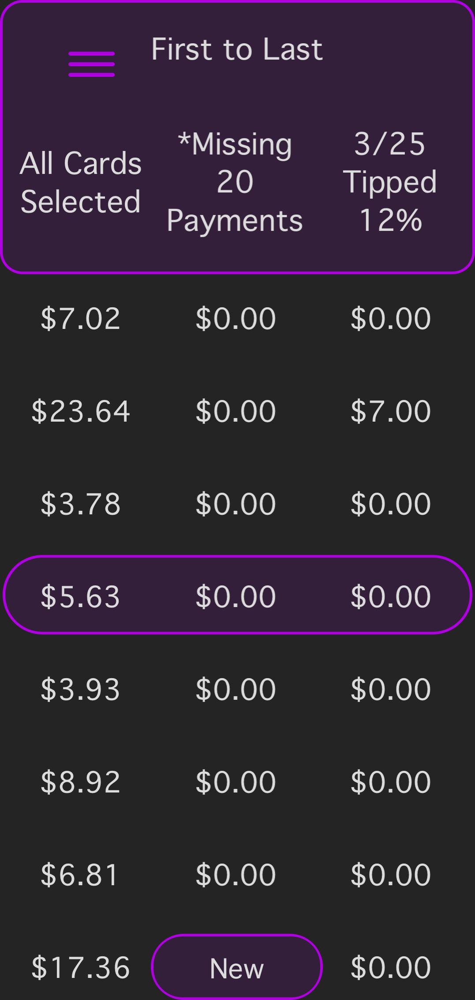

<!DOCTYPE HTML>
<html>
	<head>
		<meta http-equiv="Content-Type" content="text/html; charset=UTF-8" />
		<title>Ride Stats | The Ride Share, Delivery Stats App</title>
		<meta name="description" content="Ride Stats is the best way track rides. It was created with power and style in mind along with a colorful user experience.">
		<meta name="viewport" content="width=device-width, initial-scale=1">
		<link rel="icon" href="favicon.ico" type="image/x-icon" />

		<!-- Stylesheets -->
		<link href="stylesheet.css" rel="stylesheet" type="text/css" media="all">
		
		<!-- Javascript -->
		
		
		

		<!-- Twitter Cards -->
	    <meta name="twitter:card" content="summary_large_image" />
	    <meta name="twitter:site" content="@CSelpien" />
	    <meta name="twitter:title" content="https://rootsbin.github.io/ridestatsapp/" />
	    <meta name="twitter:description" content="Hand crafted stats app calebrated for speed." />
	    <meta name="twitter:url" content="https://rootsbin.github.io/ridestatsapp/" />
	    <meta name="twitter:image" content="https://rootsbin.github.io/ridestatsapp/assets/images/Ride Stats-app.png" />
	    <meta name="twitter:creator" content="@CSelpien" />
	    
	    <!-- Facebook OG -->
	    <meta property="og:title"     content="Ride Stats | Swipe and Calculate rides" />
	    <meta property="og:description" content="Ride Stats is a hand crafted stats app calebrated for speed." />
	    <meta property="og:type"      content="website" />
	    <meta property="og:url"       content="https://rootsbin.github.io/ridestatsapp/" />
	    <meta property="og:locale"    content="en_us" />
	    <meta property="og:site_name" content="Ride Stats for Reddit"/>
	    <meta property="og:image"     content="https://rootsbin.github.io/ridestatsapp/assets/images/Ride Stats-app.png" />
	    <link rel="pingback" href="<?= bloginfo( 'pingback_url' ) ?>" />

		<!-- Analytics -->

	</head>

	<body>
		
		<header>
			

				
			

			

				<h1>Ride Stats</h1>
				
General Statisitcs app for Ride Share and Delivery drivers.

			

		</header>

		
This is the Ride Stats App! An app built by an oridinary Ride Share / Delivery Driver. Here you can calculate what you make per ride or delivery and estimate an hourly rate. Storing rides like this over time will produce more data to help imrove your Ride Share and or Delivery expirence. Welcome to my very first published program! This is the first of many to come. From my tools and your feedback, we can make the best of any application! Thank you for supporting this individual developer.

		

		

			

				

					

						

							<h2>Swiping is everything</h2>
							
Swiping is not only fun, it makes it easy to access more data. Its everywhere within the Ride Stats App. You swipe to calculate new rides. Swipe to see current and past statistics. Even to access extended functions. With all those rides calculated. Its easy to skim through features to get where you need to go. But many times you may just want to switch press a button. The interactive help options change the interface to reviel a set up buttons to navigate the ride selections. Its easy to get there, just press the (?) when calculating.

						

						

							
						

					

				

				

					

						

							<h2>Just Calculate Mode or Standard Edition?</h2>
							
There are two (2) modes in the Ride Stats App. The first is Just Calcualte Mode. Here you can calculate rides based on milage, time and or rate per ride/delivery. With the ability to show statistics on a range of rides (up-to 100). 

							
The Standard Edition includes the ability to track those same rides in time. Storing the rides in sessions. With the Standard Edtion unlocked (premium feature). You can see your stats live. And After saved, see how those rides relate to your past rides. You can also select from a range of 12 color options in the settings menu.

						

						

							
						

					

				

				

					

						

							<h2>Works for Ride Share and Delivery Drivers</h2>
							
Build an unlimted amount of Service Cards of all different types. Track, not for only one service. But as many as you like! Start by adding a Card Name in the Edit Service Cards menu. Only the name is required!

							
As a Ride Share Driver, you're paid by your Ride Min, Mile/Km Rate, Minute Rate, Base Rate and Cancel Rate. Find what these values are within the contract details of your service.

							
Creating Service Cards as a Hourly Deliver Driver: Enter what you are paid per delivery as the Ride Min, Base Rate and Cancel Rate. Press "Show More Options.." and enter your Hourly Pay. Being you are paid in cash at the end of your shift. Toggle Pay Out option on that page. You can then press 'Return' and then 'Start'.

						

						

							
						

					

				

				

					

						

							<h2>Sort, Show, Select your rides in an list</h2>
							
Swipe up on the Current Ride and be presented by your current selected ride in a list. Press the 'All Cards Selected' Button to cycle your many Service Cards. Tap the Tip Break Down and precent so your tips can be added to their ride total. Even if you miss a payment you can cylcle the list to the next missing one. When you want to add a new ride. Do that by holding the selected ride. Do this to select anoter ride as well.

						

						

							
						

					

				

				

					

						

							<h2>Compare Total Gross, Hourly pay and Tips</h2>
							
Visit the 'Past Session' menu. To see the Totals in a wide range of ways. Press the 'All Time' Button and see your Past Sessions by Current or Last Week/Month/Year. Also, scroll through the lists of Years/Months/Weeks from start times of sessions past. Press and Hold to make your selection in the list. After your selection, the list will populate with the sessions in the selected range. View or Delete a Past Session by Holding it after the list generates. 

						

						

							
						

					

				

				

					

						

							<h2 >Dark Mode Enabeled</h2>
							
Ride Stats was built from the start with Dark Mode. That's great when you want something easier on your eyes at night, or you just prefer Dark Modes! But some perfer a Light Mode, so theres that. If there too much contrast, toggle OG contrast to soften the interface. All accessable in the settings menu.

						

						

							
						

					

				

				

					

						

							<h2>iPad Expirence</h2>
							
Enjoy Ride Stats not only on your iPhone, but also on your iPad! Ride Stats on iPad is still a work in progress, with some exceptional features planned that wound really bring it to the next level. Showing exactly what the iPad has to offer as an incredible computing device. With the expanded views and more accessable functions!

						

						

							
						

					

				

			

			<h2 class="etc">Starting Calculating Ride Statisitcs Today!</h2>

			

		

		<footer><a href="http://reddit.com/r/RideStatsApp">/r/RideStatsApp</a> <a href="https://twitter.com/CSelpien">@CSelpien</a> <a href="mailto:contact@RideStatsapp.io">Contact</a></footer>
	</body>
</html>